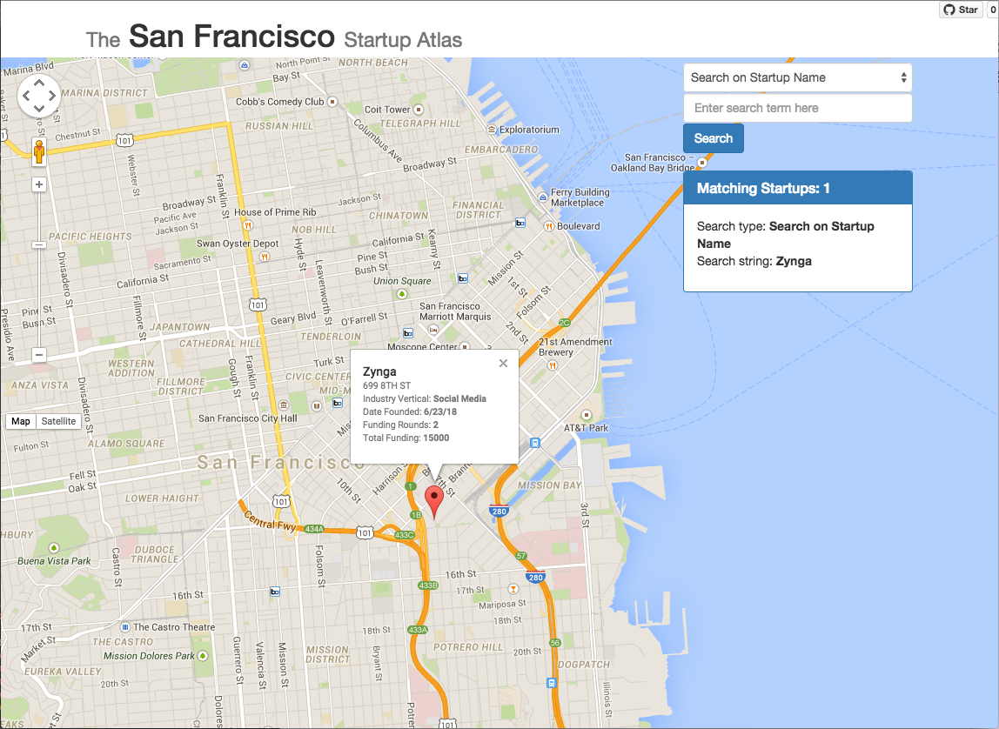
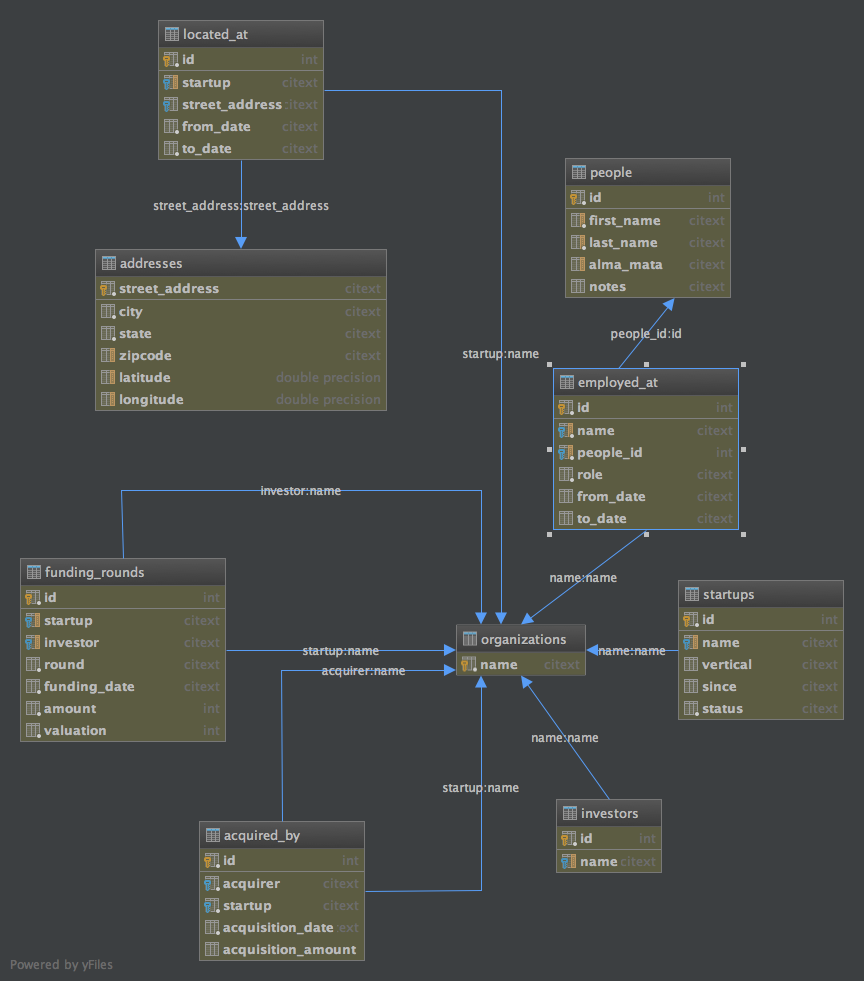

#San Francisco Startup Atlas
###WARNING: THIS APPLICATION IS POPULATED WITH TEST DATA
The application has been designed to illustrate functionality and has been populated with invented data and relationships to accomplish this purpose. While CrunchBase data and City of San Francisco location data has served as a starting point, the data in the application differs from these starting sources significantly (and not in a good way!).

###Testing the application
####Launching the application
Launch the application using JettyRunner: http://localhost:8080/search

The application uses Google Maps, and the Google API key will only permit access when using the above address.

####Test queries
The application will only produce results on exact matches.

The easiest way to get test data is to start off by querying a San Francisco zipcode where there happen to be many startups. PLEASE REMEMBER THAT THE DATA AND RELATIONSHIPS ARE NOT IN ANY WAY ACCURATE.

Here are some sample search terms for which the database has information:
- Startup Name Searches
  - Zynga
  - AKQA
  - Twitter

- Investor Name Searches
  - AdTonik
  - Aduro Advisors
  - Aedeas Group
  - AGC

- Zipcode Searches
  - 94103
  - 94107
  - 94114

- Searches on Individuals
  - Andrew Kent
  - Steven Willmott
  - Patrick	Sullivan

##Introduction
The San Francisco Startup Atlas is a web application that tracks startup activity in San Francisco by plotting the location of startup companies on a map of the city. The intent is to illuminate the nexus between startups as logical/financial entities and their physical manifestations in terms of office space.

###Interface
The application provides a simple interface that allows searching for startup companies based on a variety of criteria. The results are plotted on a Google map. Information on particular startups can be viewed by clicking on its map icon.



###Information accessible via the Atlas
In addition to physical location, the application provides details regarding each startup's funding. The names of principals, founders, and investors can also be used as a starting point for searches.

###Historical information
The application contains data on past startups as well as present-day startups.

###Intended use
The San Francisco Startup Atlas is intended to serve two primary purposes:
- Assisting those who, for practical reasons, are interested in the physical dimensions of San Francisco's startup scene: local tourists, job-seekers, or residents of San Francisco wanting to know more about their neighbors
- Providing those who may have no practical need for the data with a tool that will prove mildly diverting for the period of an extended sojourn to the restroom

###Foundational use-cases
The following are some core use-cases around which the San Francisco Startup Atlas is being developed:

1. You go out one morning and find that the run-down warehouse on the corner is suddenly blanketed in trendy landscaping and surveillance cameras. By punching in the zipcode you should be able to quickly determine whether you have a new startup on your hands, or just another grow-op.
2. You are looking for a new gig and have heard of a company called Zynga. You want to be able to see where in the city they are located.
3. You hear of a new venture capital firm and are interested in seeing how widely they have invested with startups in San Francisco.
4. You meet an entrpreneur/founder who says he has been involved with lots of startups. You are interested in seeing exactly which startups he has been involved with and where in the city.

###Motivation
This application is being developed as a class project for cs333 at University of San Francisco, taught by EJ Jung.

##Technology Overview
The San Francisco Startup Atlas is built with the following technology components:
- [Java 8](http://www.oracle.com/technetwork/java/javase/downloads/index.html)
- Web front-end:
  - [Jetty](http://www.eclipse.org/jetty/)
  - [BootStrap](http://getbootstrap.com/)
- [PostgreSQL database](http://www.postgresql.org/)

#The San Francisco Startup Atlas Database
##Data Sources
Some of the data used by The San Francisco Startup Atlas has been extracted from [CrunchBase](https://www.crunchbase.com/). Taken as a whole, the data consists of approximately 10,000 records. Approximately one quarter of the database entries represent startup companies, with the rest representing funding entities, details on funding rounds, addresses, and individuals.

Thanks to everyone at [CrunchBase](https://www.crunchbase.com/) for making this data publicly available!

Address and geolocation information has been extracted from data made available by the city of San Francisco.

##Database Structure

###Entity Relationship Diagram


###Relational Schema


###Indexes
As data is entered into the database irregularly and by batch, speed of lookup is the primary driver for indexing.

Most lookups for this application are equality lookups: we are searching for specific startups that meet certain criteria, then populate their attributes based on equality relationships. For this reason most indexes will be hash indexes. The exception here is with regards to addresses and people: columns in these tables are indexed using B+ tree indexes to facilitate range searches.

The database used for this application is PostgreSQL, which automatically indexes all primary keys and all columns with unique constraints. The default PostgreSQL indexing method is B+ tree. By default, PostgreSQL's automatic indexing is not be case insensitive. The 'citext' extension has been applied to the database so that these indexes will behave in a case-insensitive manner, and all text fields have been defined as citext.

####Index costs
- B+ Tree Index (PostgreSQL default)
  - Equality Search: D(1+logF 0.15B)
  - Range Search: D(LogF 0.15B + number of matching records)
- Hash Index
  - Equality Search: 2D
  - Range Search: BD

###Table sizes
- addresses (83,609 records)
- employed_at (7,835 records)
- funding_rounds (13,560 records)
- investors (401 records)
- located_at (2,225 records)
- organizations (7,216 records)
- people (7,835 records)
- startups (6,780 records)


####Created Indexes
- addresses
  - zipcode (B+ tree)
  - latitude (B+ tree)
  - longitude (B+ tree)

- located_at
  - startup (hash)

- people
  - first_name (B+ tree)
  - last_name (B+ tree)
  - alma_mata (B+ tree)

- employed_at
  - name (hash)
  - people_id (hash)

- funding_rounds
  - startup (hash)
  - investor (hash)

- investors
  - name (hash)

- startups
  - name (hash)

###SQL Queries
####Table Creation Queries
The queries necessary to create and the database and populate it with data from .csv files is located in the [create_db.sql](/create_db.sql/) file.
####Test Data
CSV files containing test data have been created for each table:
- AcquiredBy table: [AcquiredBy.csv](/AcquiredBy.csv/)
- Addresses table: [Addresses.csv](/Addresses.csv/)
- EmployedAt table: [EmployedAt.csv](/EmployedAt.csv/)
- FundingRounds table: [FundingRounds.csv](/FundingRounds.csv/)
- Investors table: [Investors.csv](/Investors.csv/)
- LocatedAt table: [LocatedAt.csv](/LocatedAt.csv/)
- Organizations table: [Organizations.csv](/Organizations.csv/)
- People table: [People.csv](/People.csv/)
- Startups table: [Startups.csv](/Startups.csv/)

####Functionality Queries
The following queries support the application's core functionality and are contained in the [application_queries.sql](/application_queries.sql/) file.

#####Validation query
```sql
SELECT table_name FROM information_schema.tables WHERE table_schema = 'public';
```

#####Given a startup zipcode, find startups in that zipcode
```sql
select startups.name,
  startups.vertical,
  startups.since,
  addresses.street_address,
  addresses.latitude,
  addresses.longitude,
  count(funding_rounds.amount) as rounds,
  sum(funding_rounds.amount) as total_funding
from startups
  join located_at on startups.name = located_at.startup
  join addresses on located_at.street_address = addresses.street_address
  join funding_rounds on startups.name = funding_rounds.startup
where addresses.zipcode='94107'
group by startups.name,
  startups.vertical,
  startups.since,
  addresses.street_address,
  addresses.latitude,
  addresses.longitude;
```

#####Given a startup name, find the current location of that startup
```sql
select startups.name,
  startups.vertical,
  startups.since,
  addresses.street_address,
  addresses.latitude,
  addresses.longitude,
  count(funding_rounds.amount) as rounds,
  sum(funding_rounds.amount) as total_funding
from startups
  join located_at on startups.name = located_at.startup
  join addresses on located_at.street_address = addresses.street_address
  join funding_rounds on startups.name = funding_rounds.startup
where startups.name = 'Yelp'
group by startups.name,
  startups.vertical,
  startups.since,
  addresses.street_address,
  addresses.latitude,
  addresses.longitude;
```

#####Given the name of an individual, list all startups he/she has been involved with
```sql
select startups.name,
  startups.vertical,
  startups.since,
  addresses.street_address,
  addresses.latitude,
  addresses.longitude,
  count(funding_rounds.amount) as rounds,
  sum(funding_rounds.amount) as total_funding,
  employed_at.role,
  employed_at.from_date,
  employed_at.to_date
from employed_at
  join people on people.id = employed_at.people_id
  join startups on startups.name = employed_at.name
  join located_at on startups.name = located_at.startup
  join addresses on located_at.street_address = addresses.street_address
  join funding_rounds on startups.name = funding_rounds.startup
where people.first_name='Bob' and
      people.last_name='Goodson'
group by startups.name,
  startups.vertical,
  startups.since,
  addresses.street_address,
  addresses.latitude,
  addresses.longitude,
  employed_at.role,
  employed_at.from_date,
  employed_at.to_date;
```

#####Given the name of an investor, list all the startups invested in
```sql
select startups.name,
  startups.vertical,
  startups.since,
  addresses.street_address,
  addresses.latitude,
  addresses.longitude,
  count(funding_rounds.amount) as rounds,
  sum(funding_rounds.amount) as total_funding,
  investors.name
from investors
  join funding_rounds on funding_rounds.investor = investors.name
  join startups on funding_rounds.startup = startups.name
  join located_at on startups.name = located_at.startup
  join addresses on located_at.street_address = addresses.street_address
where investors.name = 'Angelrush Ventures'
group by startups.name,
  startups.vertical,
  startups.since,
  addresses.street_address,
  addresses.latitude,
  addresses.longitude,
  investors.name;
```

##Development Tools
The following development tools were used in creating this project:
- [Atom](https://atom.io/)
- [IntelliJ Idea](https://www.jetbrains.com/idea/)
- [OmniGraffle for Mac](https://www.omnigroup.com/omnigraffle/)

##About the Developer
David Westgate is a Computer Science student at University of San Francisco.

##License
Distributed under the [MIT License](/LICENSE.md/).
